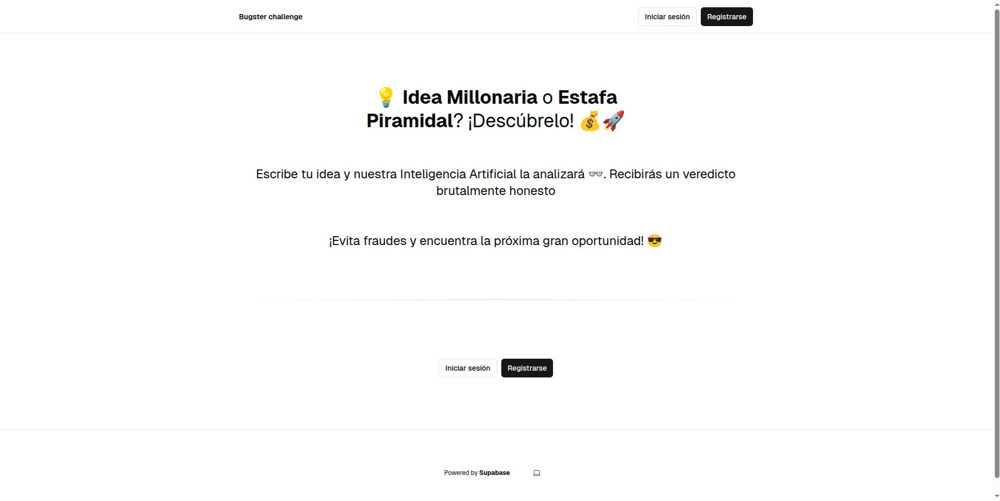
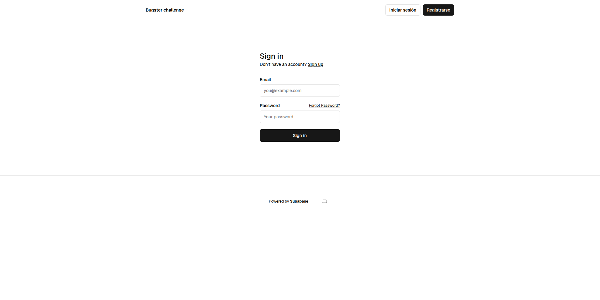
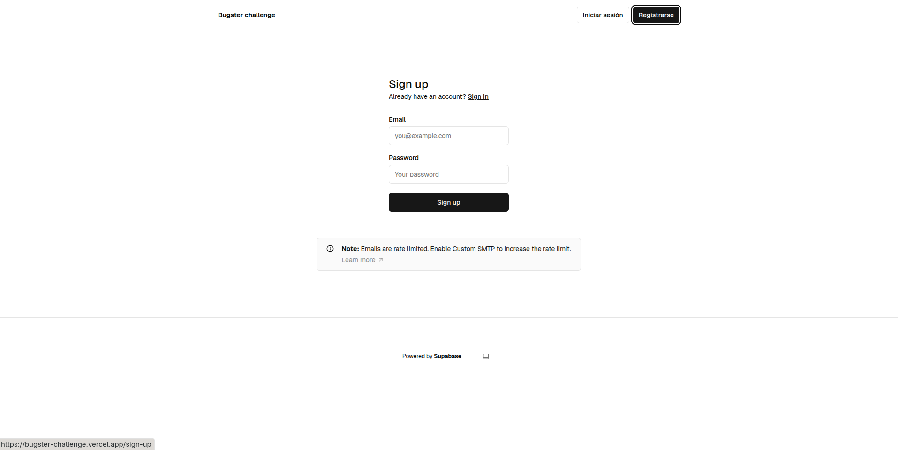
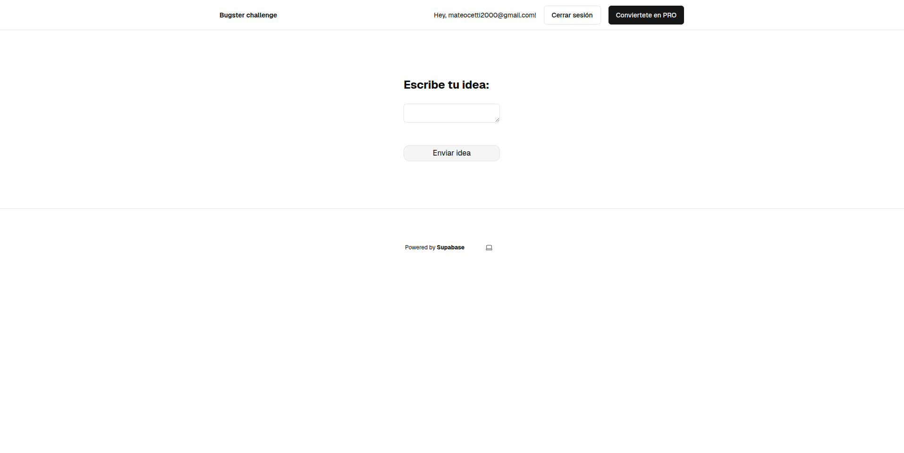
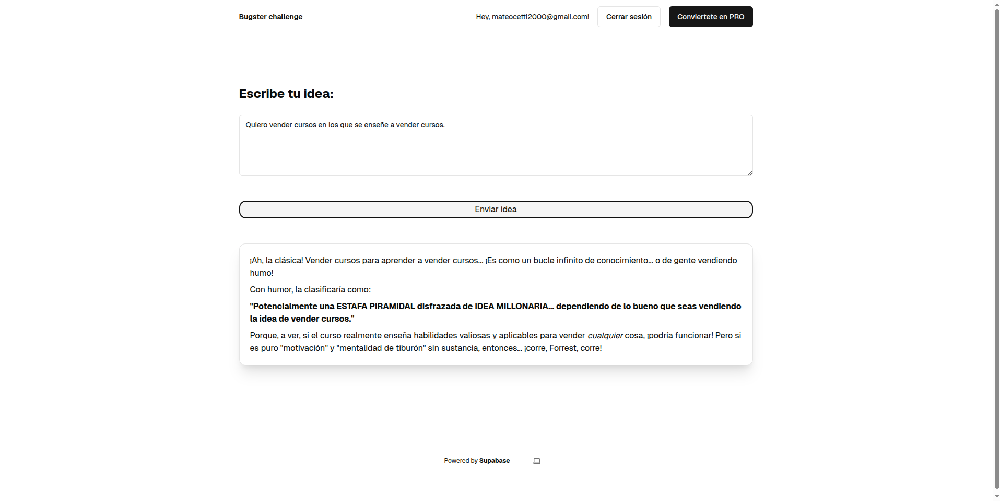
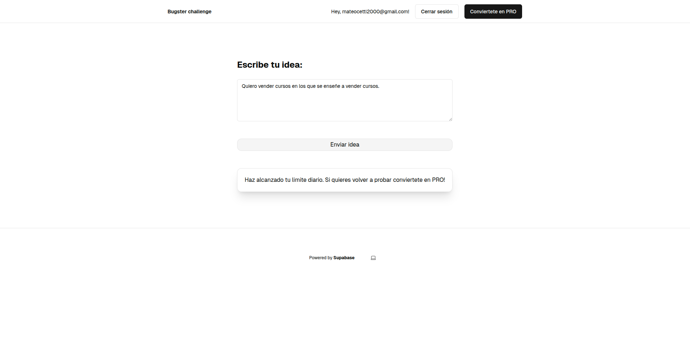
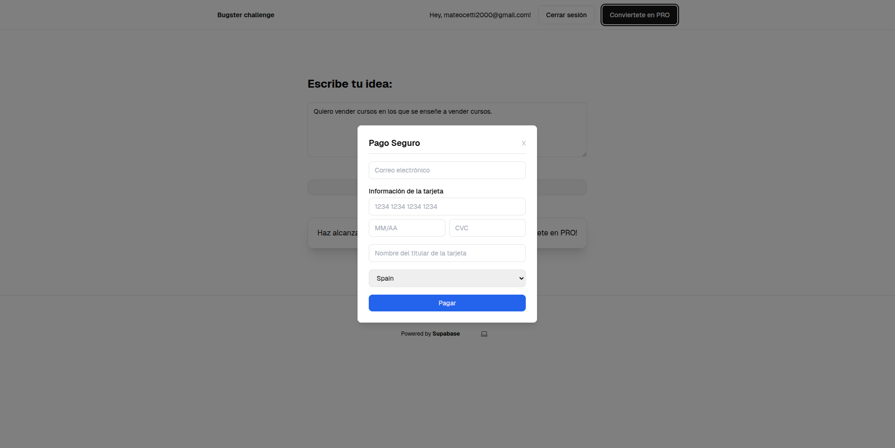

# BUGSTER CHALLENGE

Este repositorio contiene el código desarrollado para el [challenge técnico - Bugster](https://github.com/Bugsterapp/millonaria-o-piramidal).

En este challenge se propone realizar una webapp que reciba una idea y la clasifique como:
* 🚀 MILLONARIA
* 💸 ESTAFA PIRAMIDAL

## Contenido desarrollado

La webapp cuenta con una landing page.

Esta landing contiene un navbar con el nombre de la webapp, un boton de iniciar sesión y de registrarse (este navbar estara presente en todas las páginas de la webapp, cambiando su contenido dinamicamente según el estado de la sesión del usuario), y una main page con el titulo del proyecto y una breve descripción acerca del mismo. Ademas, se cuenta con unos CTA a login y registrarse y un footer (que tambien estara presente en el resto de páginas) en el que se puede cambiar el tema de la página.

Para poder clasificar la idea, debemos iniciar sesión, y para ello debemos estar registrados en el sistema. Para esto hacemos uso de las funcionalidades de auth provistas por Supabase.

Una vez que iniciamos sesión se nos redirige a esta página en la que podremos clasificar nuestra idea introduciendola en el textarea.

Si no tenemos la subscripción PRO y queremos enviar mas de 2 ideas en un día, el sistema nos devolverá este mensaje:

Para poder convertirnos en usuarios PRO debemos de acer click en el boton "Conviertete en PRO" en el navbar, hecho que desplegará un modal de checkout.

Al completar la compra seremos automaticamente usuarios PRO y podremos realizar ilimitadas categorizaciones de ideas.

## Que no llegué a hacer

* Realizar una UI con una user experience mas amena
* Realizar bien el checkout con Stripe

## Enfoque

Mi enfoque en el desarrollo fue cumplir con las funcionalidades planteadas en el tiempo establecido, dejando de lado cuestiones como la usabilidad de la interfaz y el testing / QA.

En un momento del desarrollo encontré un template de un proyecto de NextJS en el que las funcionalidades de auth de Supabase ya estaban desarrolladas (Ademas de algunas páginas). Hice uso de ese código para acelerar el desarrollo.

Ya que no poseo una api key de OpenAI, investigué y encontre que Gemini posee una api gratuita. por lo tanto hice uso de la misma para este proyecto.